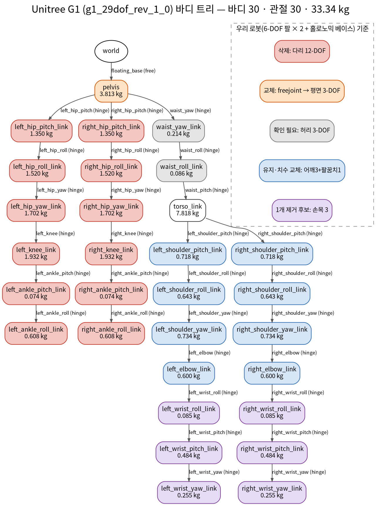

# Unitree G1 MJCF 구조 분석 → 우리 로봇 적용 변경 목록

- 주차: week02 (B1 커리큘럼 박종진 개별 과제)
- 대상: `mujoco_menagerie/unitree_g1/g1.xml` (model `g1_29dof_rev_1_0`), MuJoCo 3.14.0
- 재현: `python scripts/g1_inspect.py <mujoco_menagerie 경로> img` → [img/g1_body_tree.txt](img/g1_body_tree.txt), [img/g1_arm_joints.md](img/g1_arm_joints.md), [img/g1_default_vs_moved.png](img/g1_default_vs_moved.png)

## 1. 요약 수치

| 항목 | G1 | 우리 로봇 (기획서 잠정 사양) |
|---|---|---|
| 바디 수 (world 포함) | 31 | – |
| 관절 | 30 = freejoint 1 + hinge 29 | 베이스 3 + 팔 6×2 (+ 허리·헤드 미정) |
| nq / nv / nu | 36 / 35 / 29 | – |
| 총질량 | 33.34 kg | ≤ 80 kg (베이스 포함) |
| 팔 자유도 | **7** × 2 (어깨 3 · 팔꿈치 1 · 손목 3) | **6** × 2 |
| 어깨 / 팔꿈치 토크 한계 | ±25 / ±25 Nm | 100 Nm급 / 40 Nm급 |
| 하체 | 다리 6-DOF × 2 + floating base | 홀로노믹 베이스 (기보유) |
| 액추에이터 모델 | `position`, kp=500, dampratio=1, 관절 범위 상속 | 힘제어 가능 구동기 → 토크(`motor`) 입력 필요 |
| 시뮬 옵션 | `integrator="implicitfast"`, timestep 0.002 s(기본) | 관절 제어 1 kHz → 0.001 s 검토 |

## 2. 바디 트리



재현: `python scripts/g1_tree_diagram.py <mujoco_menagerie 경로> img` (graphviz 필요, 없으면 .dot만 생성)

```
world
└─ pelvis  [floating_base_joint(free)]  3.813 kg   ← site imu_in_pelvis
   ├─ left_hip_pitch → hip_roll → hip_yaw → knee → ankle_pitch → ankle_roll   (hinge 6)
   ├─ right_hip_pitch → … → right_ankle_roll                                  (hinge 6)
   └─ waist_yaw_link [waist_yaw] 0.214 kg
      └─ waist_roll_link [waist_roll] 0.086 kg
         └─ torso_link [waist_pitch] 7.818 kg      ← site imu_in_torso, head·logo는 torso의 geom
            ├─ left_shoulder_pitch → shoulder_roll → shoulder_yaw → elbow
            │     → wrist_roll → wrist_pitch → wrist_yaw                       (hinge 7)
            └─ right_shoulder_pitch → … → right_wrist_yaw                      (hinge 7)
```

전체(질량 포함)는 [img/g1_body_tree.txt](img/g1_body_tree.txt).

관찰
- **MJCF는 body 중첩 = 트리**다. 각 body 안의 `<joint>`가 "부모 → 이 body" 사이의 자유도이고, joint가 없는 body는 부모에 고정된다. (G1의 head는 별도 body가 아니라 torso의 geom)
- 명명 규칙이 `{side}_{부위}_{운동}_{link|joint}` 로 일관돼 있다 → 우리 링크 이름 규칙에 그대로 차용 제안(ICD).
- 센서 위치는 `<site>`(imu_in_pelvis, imu_in_torso, left/right_foot)로 표시. Isaac Sim에서는 이런 위치를 **별도 링크(fixed joint)** 로 두어야 prim path로 지정할 수 있다.
- visual geom은 `density="0"`, `contype/conaffinity=0` 으로 질량·충돌에서 제외, collision geom과 분리돼 있다.

## 3. 팔 관절 표 (왼팔, 화요일 과제)

| 관절 | 축(바디 좌표) | 범위 [deg] | gear | kp | 토크 한계 [Nm] |
|---|---|---|---|---|---|
| left_shoulder_pitch_joint | y | −177.0 ~ 153.0 | 1 | 500 | ±25 |
| left_shoulder_roll_joint | x | −91.0 ~ 129.0 | 1 | 500 | ±25 |
| left_shoulder_yaw_joint | z | −150.0 ~ 150.0 | 1 | 500 | ±25 |
| left_elbow_joint | y | −60.0 ~ 120.0 | 1 | 500 | ±25 |
| left_wrist_roll_joint | x | −113.0 ~ 113.0 | 1 | 500 | ±25 |
| left_wrist_pitch_joint | y | −92.5 ~ 92.5 | 1 | 500 | ±5 |
| left_wrist_yaw_joint | z | −92.5 ~ 92.5 | 1 | 500 | ±5 |

- **기어비:** MJCF의 `gear`는 "제어 입력 → 관절 토크" 배율이고 G1은 전부 1(기본값)이다. 실제 감속기 기어비는 모델에 없고, 토크 한계는 joint의 `actuatorfrcrange`, 감속기 반영 회전자 관성은 `armature=0.01`(default class)로만 들어가 있다.
- 오른팔은 roll 범위가 좌우 반전(−129 ~ 91°), 나머지 동일.
- 축은 모두 해당 body 좌표계의 x/y/z 단위축 → body 자세(quat)로 실제 방향이 정해진다. (예: shoulder_roll_link는 x축 −16° 회전된 body)

## 4. 우리 로봇(6-DOF 팔 × 2 + 홀로노믹 베이스)에 맞추기 위한 변경 목록

| No. | 부위 | G1 | 변경 내용 | 필요한 입력 (출처) | 우선순위 |
|---|---|---|---|---|---|
| 1 | 루트 | pelvis + `freejoint` | 베이스 body를 루트로. 평면 3-DOF 가상 관절(`slide x` · `slide y` · `hinge z`)로 표현 (기획서: 베이스 3-DOF를 WBC 부동 자유도로 통합) | 베이스 치수 · 질량 (하체 실측, SRR) | 높음 |
| 2 | 하체 | 다리 12 hinge | 삭제. 바퀴는 1단계에서 모델링하지 않고 평면 관절로 대체, 필요 시 2단계에서 휠 속도 ↔ 평면 속도 변환(기구학)만 추가 | 휠 배치 · 반경 (하체 실측) | 높음 |
| 3 | 허리 | waist yaw/roll/pitch | 우리 상체에 허리 관절 유무 확인 후 유지/삭제 | 제공 상체 설계안 (하이퍼다인) | 중간 |
| 4 | 팔 | 7-DOF | **6-DOF로 축소.** 어떤 손목 관절을 빼는지는 설계안 기준 (예: 어깨 3 + 팔꿈치 1 + 손목 2) | 관절 배치 · 축 방향 (A1) | 높음 |
| 5 | 링크 치수 | G1 값 | 어깨 폭 · 상완 · 전완 길이를 리치 700 mm급에 맞게 교체 | CAD (A1) | 높음 |
| 6 | 질량 · 관성 | G1 값 | 링크별 mass · COM · 관성텐서를 CAD값 → 실측값 순으로 교체. 총질량 ≤ 80 kg 확인 | CAD (A1) → 실측 (A4) | 높음 |
| 7 | 액추에이터 | `position` kp=500 | 1단계는 `position`으로 형상 검증, WBC 단계는 `motor`(토크 입력) + `ctrlrange`/`actuatorfrcrange` = 구동기 최대 토크 | 구동기 사양 (A2, 하이퍼다인) | 중간 |
| 8 | 토크 한계 | ±25 Nm | 어깨 100 Nm급 · 팔꿈치 40 Nm급 (잠정) → 구동기 배치표 확정 후 반영 | A2 배치표 | 중간 |
| 9 | armature · friction | 0.01 / 0.3 | 감속비² × 회전자 관성, 실측 마찰로 교체 | 구동기 데이터시트 · 다이나모 시험 (A2) | 낮음 |
| 10 | 센서 | site 3개 | IMU(베이스 · 몸통), 카메라(헤드), 손목 F/T 위치를 site + 전용 링크로 | 센서 장착 좌표 (A1 · B4) | 중간 |
| 11 | 헤드 · 핸드 | 고정 geom / 러버 핸드 | 헤드 구동부 · 핸드는 미제공 부위 → 선정 후 추가 | A2 선정 결과 | 낮음 |
| 12 | 시뮬 설정 | timestep 0.002 | 관절 루프 1 kHz에 맞춰 0.001 s 검토, integrator implicitfast 유지 | B2 · B3 합의 | 낮음 |
| 13 | 이름 규칙 | `{side}_{부위}_{운동}` | 그대로 채택 → ICD에 명시 | – | 높음 |

→ 1 · 2 · 4 · 5 · 6 · 13 이 ICD 요청 항목과 직결 → [b1/docs/icd/icd-v0-request-draft.md](../../../../b1/docs/icd/icd-v0-request-draft.md)
